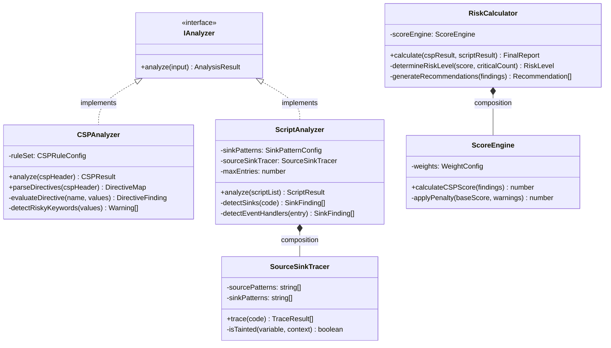
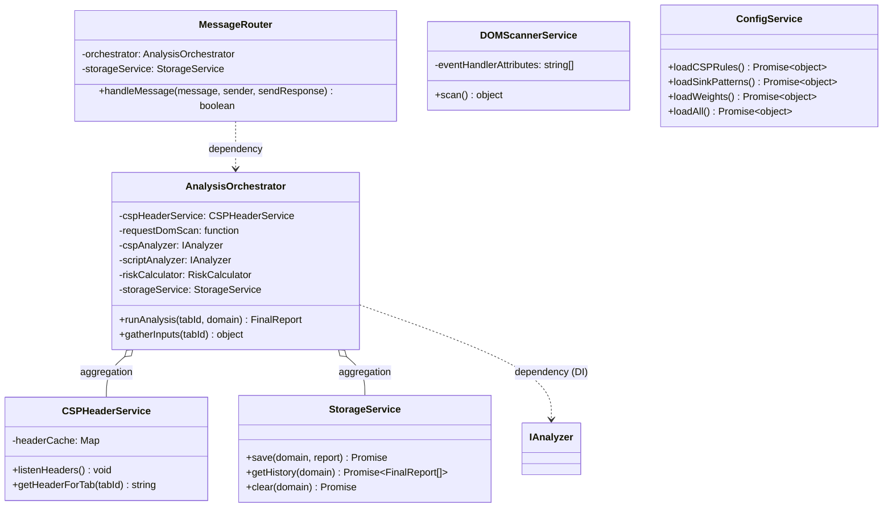
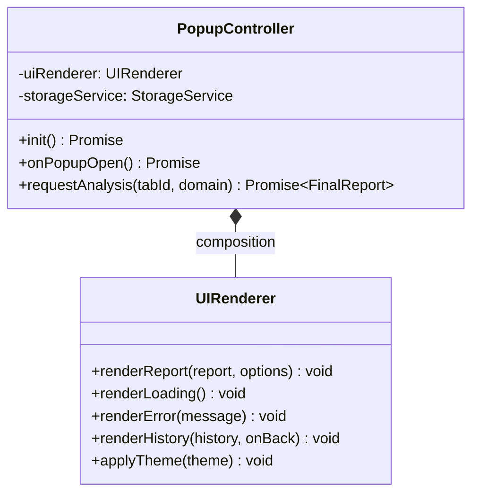

# Class Diagram — CSP-XSS Auditor

## Domain Layer



## Application & Infrastructure Layer



## Presentation Layer



## Data Class (DTO)

```
CSPResult      { score, cspFound, findings[], warnings[] }
ScriptResult   { findings[], traceResults[], criticalCount, highCount, truncated, totalEntriesReceived }
FinalReport    { domain, timestamp, cspScore, finalScore, riskLevel, cspWarnings[], scriptFindings[], recommendations[], truncated }
RiskLevel      = enum { LOW, MEDIUM, HIGH, CRITICAL }
```

## Ringkasan Relasi

| Relasi | Jenis |
|---|---|
| `CSPAnalyzer`/`ScriptAnalyzer` → `IAnalyzer` | Realization |
| `RiskCalculator` *−−♦* `ScoreEngine` | Composition |
| `ScriptAnalyzer` *−−♦* `SourceSinkTracer` | Composition |
| `AnalysisOrchestrator` *−−◇* `CSPHeaderService`, `StorageService` | Aggregation |
| `AnalysisOrchestrator` → `IAnalyzer` (via constructor) | Dependency (DI) |
| `PopupController` *−−♦* `UIRenderer` | Composition |

Class diagram ini mencerminkan seluruh prinsip SOLID: SRP per class,
OCP via `IAnalyzer`, DIP via dependency injection ke `AnalysisOrchestrator`
(diverifikasi lulus 41 unit/integration test — lihat `testing-report.md`).
