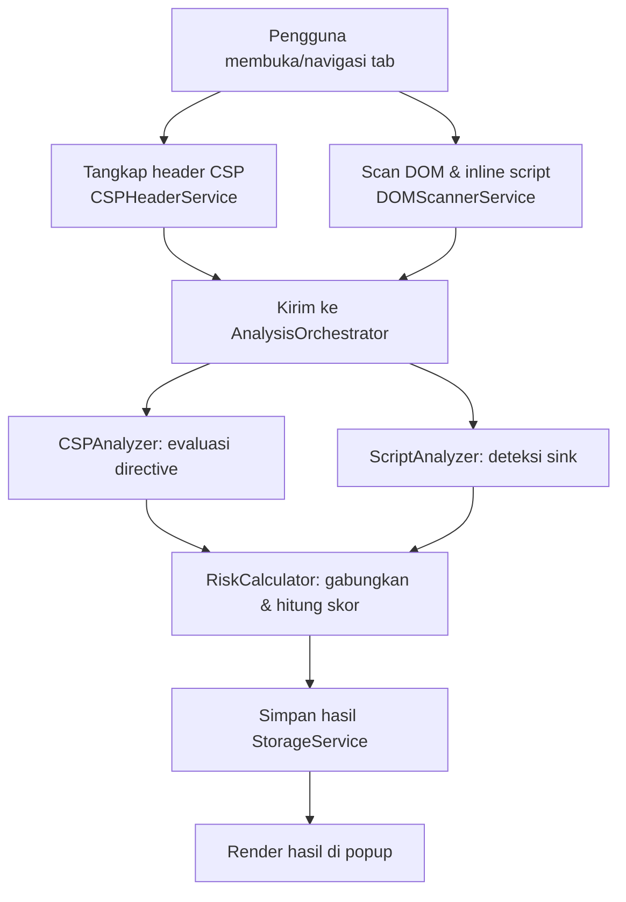
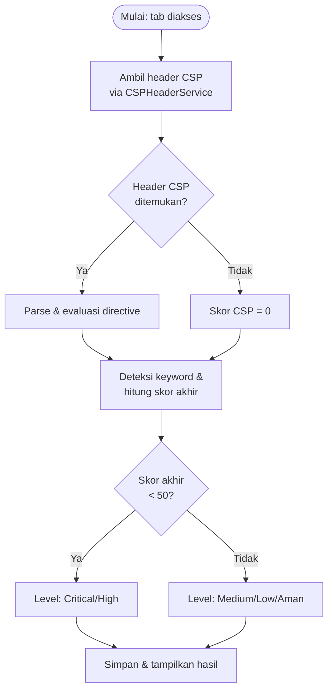

# Flowchart & Activity Diagram — CSP-XSS Auditor

## 1. Flowchart Proses Analisis (High-Level)

## 2. Activity Diagram: Penentuan Level Risiko (Detail Percabangan)

Catatan penting: level risiko akhir yang sesungguhnya di `RiskCalculator`
memiliki SATU pengecualian tambahan di luar diagram di atas — jika ada
minimal satu temuan script severity CRITICAL (mis. `eval()` aktif),
riskLevel dipaksa CRITICAL **terlepas dari skor akhir** (lihat
`architecture.md` §6 "Critical override" dan `optimization-report.md`
untuk pembahasan lengkap beserta bukti unit test-nya).
