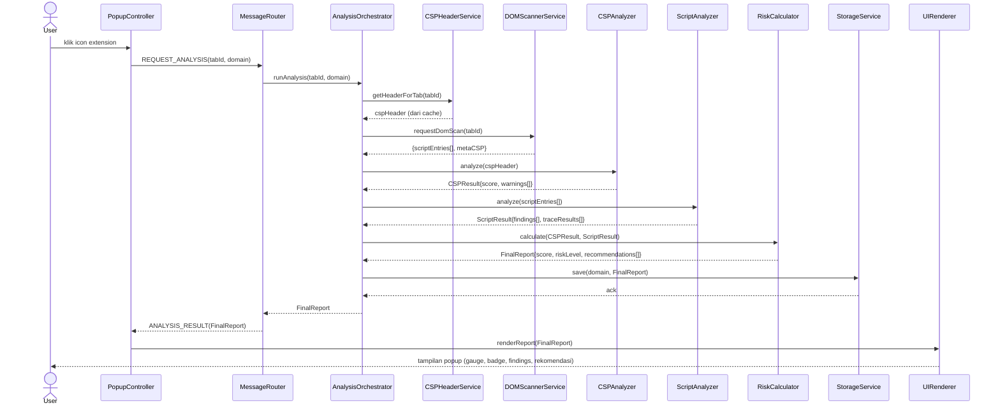

# Sequence Diagram — CSP-XSS Auditor

## Skenario: Pengguna Membuka Popup dan Melihat Hasil Analisis (UC-01)

## Catatan Penting

- Langkah `getHeaderForTab` bersifat **cache lookup**, bukan fetch ulang
  — header sudah tertangkap sebelumnya via `chrome.webRequest.onHeadersReceived`
  saat navigasi terjadi (event-driven), sehingga tidak menambah beban
  saat popup dibuka (mendukung NFR-01).
- Tidak ada roundtrip ke server eksternal manapun di seluruh sequence
  ini (mendukung NFR-06).
- Sequence ini adalah dasar skenario Black Box Testing di `testing-report.md`.
