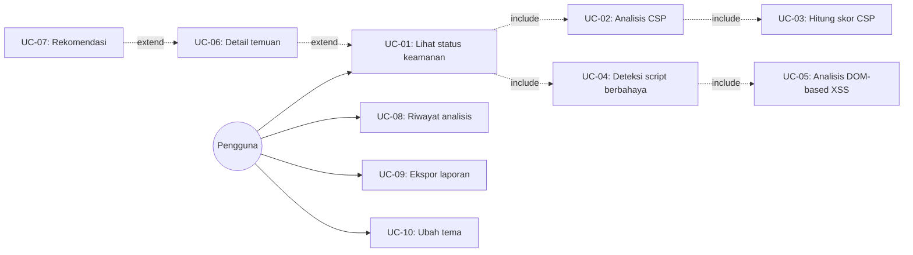

# Use Case Diagram — CSP-XSS Auditor

## 1. Aktor

Hanya **satu aktor utama**: **Pengguna (User)** — web developer/auditor.
Tidak ada aktor kedua karena sistem client-side penuh, tanpa autentikasi,
tanpa peran admin/user berbeda, dan tanpa API pihak ketiga yang men-trigger
use case (konsisten dengan NFR-06: tidak ada backend).

## 2. Daftar Use Case

| Kode | Nama Use Case |
|---|---|
| UC-01 | Melihat status keamanan tab aktif |
| UC-02 | Menganalisis konfigurasi CSP |
| UC-03 | Menghitung skor keamanan CSP |
| UC-04 | Mendeteksi script berbahaya |
| UC-05 | Menganalisis indikasi DOM-based XSS |
| UC-06 | Menampilkan detail temuan |
| UC-07 | Melihat rekomendasi perbaikan |
| UC-08 | Melihat riwayat analisis |
| UC-09 | Mengekspor laporan analisis |
| UC-10 | Mengatur preferensi tema |

## 3. Relasi

- UC-01 `<<include>>` UC-02, UC-04
- UC-02 `<<include>>` UC-03
- UC-04 `<<include>>` UC-05
- UC-01 `<<extend>>` UC-06 (opsional, saat pengguna klik detail)
- UC-06 `<<extend>>` UC-07 (opsional, hanya jika ada temuan)
- UC-08, UC-09, UC-10 berdiri independen, langsung terhubung ke aktor

## 4. Diagram (Mermaid)

Catatan: "Kenapa hanya satu aktor?" adalah pertanyaan yang wajar muncul
saat sidang — jawabannya karena sistem murni client-side tanpa server
(lihat `requirements.md` NFR-06), justru memperkuat argumen privasi.
